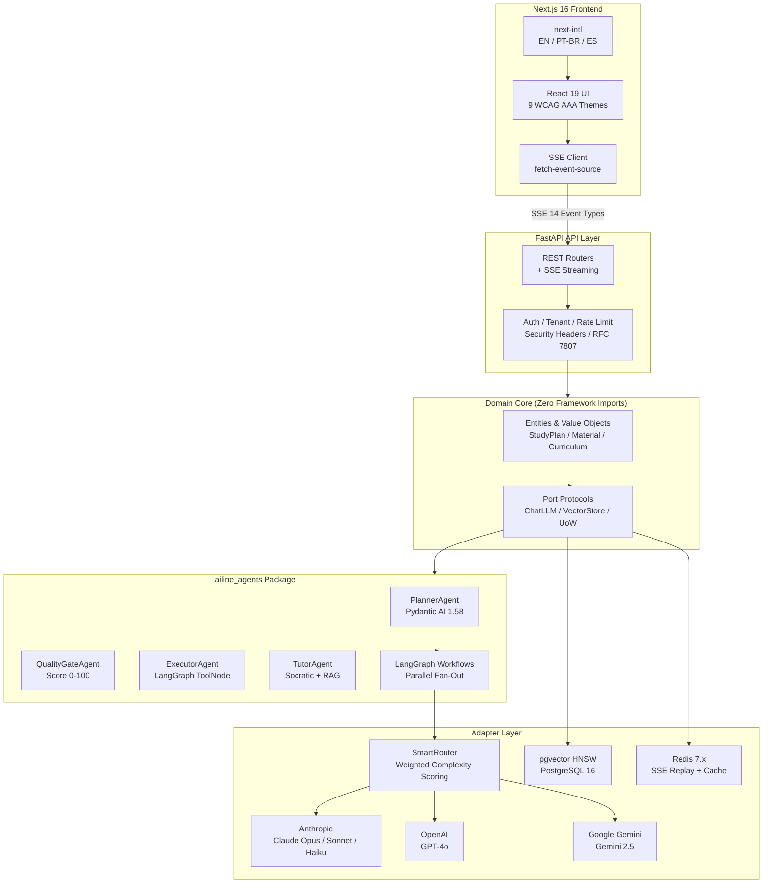
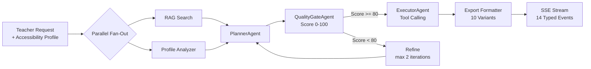

<p align="center">
  
</p>

<h1 align="center">AiLine</h1>
<h3 align="center">Adaptive Inclusive Learning — Individual Needs in Education</h3>

<p align="center">
  <strong>Every student deserves a lesson designed for them.</strong>
</p>

<p align="center">
  <a href="#quick-start">Quick Start</a> |
  <a href="#what-makes-ailine-different">Differentiators</a> |
  <a href="#architecture">Architecture</a> |
  <a href="#technology-stack">Tech Stack</a> |
  <a href="#testing">Testing</a> |
  <a href="#documentation">Docs</a>
</p>

<p align="center">
  
  
  
</p>

---

**AiLine** is a WCAG AAA educational platform that transforms classroom materials into adaptive, accessible lesson plans in real time. Teachers upload content, select student accessibility needs, and a multi-agent AI pipeline — powered by Claude Opus 4.6 — generates personalized study plans with 10 export variants. Every AI decision is visible, scored, and auditable through a Glass Box pipeline viewer.

Built in one week. 120 features. 2,800+ tests. Zero shortcuts.

---

## At a Glance

| Metric | Value |
|--------|-------|
| **Features shipped** | 120 (across 15 sprints) |
| **Total tests** | 2,800+ (1,743 runtime + 250 agents + 770 frontend) |
| **E2E tests** | 35+ Playwright (golden paths + visual regression + a11y) |
| **Live API tests** | 65 (real Anthropic / OpenAI / Gemini calls) |
| **ADRs** | 60 architecture decision records |
| **AI agents** | 4 typed (Pydantic AI 1.58) |
| **LLM providers** | 3 (Anthropic, OpenAI, Google Gemini) |
| **Accessibility themes** | 9 (WCAG AAA) |
| **Curriculum standards** | 4 (BNCC, CCSS Math, CCSS ELA, NGSS) |
| **Languages** | 3 (English, Portuguese, Spanish) |
| **Docker services** | 4 (API + Frontend + PostgreSQL 16 + Redis) |

---

## What Makes AiLine Different

### 1. Glass Box AI — Not a Black Box

Every pipeline stage is visible, scored, and auditable. Teachers see which LLM model was selected and why (SmartRouter rationale), the quality score (0-100) with 4 structural validators, RAG citation sources with confidence levels, and a full agent trace timeline. This is radical transparency applied to educational AI.

### 2. True Inclusivity — Not an Afterthought

9 disability-specific accessibility themes (hearing, visual, cognitive, motor, dyslexia, autism, ADHD, anxiety, default). Brazilian Sign Language (Libras) via VLibras 3D avatar for output and MediaPipe gesture recognition for input. Bionic Reading mode, Cognitive Curtain for focus, TTS Karaoke reader, and an Empathy Bridge simulator that lets educators experience disabilities firsthand.

### 3. Multi-LLM Resilience — No Single Point of AI Failure

SmartRouter uses weighted complexity scoring to pick the optimal model per request — Haiku for simple lookups, Sonnet for structured plans, Opus for complex tool-calling tasks. If one provider fails, automatic escalation moves up the tier ladder. Circuit breaker (5 fails -> 60s open), retry with exponential backoff, and SSE replay on reconnect ensure no work is ever lost.

### 4. Production Engineering — Built to Run, Not Just to Demo

Hexagonal architecture with zero framework imports in the domain core. 60 ADRs documenting every significant decision. Tenant isolation via JWT + composite foreign keys + vector store filtering. RFC 7807 error responses. OpenTelemetry tracing. SSE terminal guarantee (every pipeline run reaches a final state — no stuck spinners). 2,800+ tests across 4 layers.

### 5. Social Impact at Scale

4 curriculum standards (BNCC for Brazil, CCSS Math, CCSS ELA, NGSS for the USA) with Bloom's Taxonomy filtering. 3 locales. LGPD/FERPA-ready privacy controls. A single teacher can generate inclusive lesson plans for every student profile in under 90 seconds — work that currently takes hours of manual adaptation.

---

## Quick Start

```bash
# 1. Clone and configure
git clone <repo-url> && cd aiLine
cp .env.example .env
# Add your API keys: ANTHROPIC_API_KEY, GOOGLE_API_KEY (minimum)

# 2. Launch (one command)
docker compose up -d --build

# 3. Open
# Frontend:  http://localhost:3000
# API docs:  http://localhost:8000/docs
# Health:    http://localhost:8000/health/ready
```

All 4 services start with health checks and readiness probes. **Demo mode** provides cached golden-path responses for offline operation.

---

## Architecture

**Hexagonal (Ports-and-Adapters)** — the domain core has zero framework imports. All external systems are accessed through protocol interfaces.



### AI Pipeline Flow



### Project Structure

```
agents/              # ailine_agents package — 4 Pydantic AI agents + LangGraph workflows
runtime/
  ailine_runtime/
    domain/          # Pure entities + port protocols (zero imports)
    adapters/        # Anthropic, OpenAI, Gemini, pgvector, ChromaDB adapters
    app/             # Use cases: plan generation, tutor chat, RAG, authz
    api/             # FastAPI routers + middleware + SSE streaming
    accessibility/   # Quality gate + 10 export variants
frontend/            # Next.js 16, React 19, Tailwind 4, 9 WCAG AAA themes
skills/              # 11 SKILL.md files (lesson-planner, socratic-tutor, etc.)
control_docs/        # 7 canonical engineering docs (498 lines total)
docs/                # Judge packet, demo script, feature map, architecture diagrams
```

See [Architecture Diagrams](docs/architecture-diagram.md) (8 Mermaid diagrams) and [System Design](control_docs/SYSTEM_DESIGN.md) for details.

---

## Technology Stack

| Layer | Technology | Purpose |
|-------|-----------|---------|
| **Backend** | Python 3.13, FastAPI 0.129, SQLAlchemy 2.x async | API, data access, SSE streaming |
| **AI Agents** | Pydantic AI 1.58, LangGraph 1.0.8 | Typed agents with workflow orchestration |
| **LLMs** | Claude (Opus/Sonnet/Haiku), GPT-4o, Gemini 2.5 | Multi-provider with SmartRouter |
| **Embeddings** | gemini-embedding-001 @ 1536d | Matryoshka truncation for RAG |
| **Vector Store** | pgvector 0.8 (HNSW) on PostgreSQL 16 | Semantic search with tenant isolation |
| **Frontend** | Next.js 16, React 19, Tailwind 4, React Compiler 1.0 | SSR, streaming, auto-memoization |
| **Accessibility** | 9 CSS themes, VLibras, MediaPipe, ElevenLabs TTS | WCAG AAA universal design |
| **i18n** | next-intl 4.8.2 | 3 locales (EN, PT-BR, ES) |
| **Infrastructure** | Docker Compose, Redis 7.x, GitHub Actions CI | One-command deployment, 6-job CI |
| **Testing** | pytest, Vitest, Playwright, axe-core | 2,800+ tests across 4 layers |

---

## Screenshots

> Screenshots will be added before final submission. Key screens:

| Screen | Description |
|--------|-------------|
| **Dashboard** | Bento grid layout with plan cards, staggered entrance animations |
| **Pipeline Viewer** | Glass Box real-time SSE events, score gauge, SmartRouter badge |
| **Accessibility Themes** | Side-by-side of 9 persona themes (hearing, dyslexia, ADHD, etc.) |
| **Tutor Chat** | Socratic AI responses with RAG citations and confidence scores |
| **Export Twin** | Side-by-side original vs adapted lesson with diff highlights |
| **Sign Language** | VLibras 3D avatar + webcam gesture recognition |
| **Observability** | Latency sparklines, circuit breaker state, token usage charts |

---

## Testing

```bash
# Run everything inside Docker (source of truth)
docker compose up -d --build
docker compose exec api bash -c "cd /app && uv run pytest -v --cov"

# Or run locally:

# Backend — 1,743 tests
cd runtime && uv run pytest -v --cov

# Agents — 250 tests
cd agents && uv run pytest -v

# Frontend — 770+ tests
cd frontend && pnpm test

# E2E — 35+ Playwright specs
cd frontend && pnpm exec playwright test

# Live API — 65 tests (API keys required)
cd runtime && uv run pytest -m live_llm -v --timeout=120
```

---

## Documentation

| Document | Description |
|----------|-------------|
| [Judge Packet](docs/judge-packet.md) | 1-page project summary for judges |
| [Demo Script](docs/demo-script.md) | 3-minute "Meet Ana" demo narrative |
| [Feature Map](docs/feature-map.md) | 120 features across 8 capability areas |
| [Architecture Diagrams](docs/architecture-diagram.md) | 8 Mermaid diagrams |
| [System Design](control_docs/SYSTEM_DESIGN.md) | Architecture, data flows, 60 ADR log |
| [Test Strategy](control_docs/TEST.md) | Test matrix, coverage targets, how to run |
| [Security](control_docs/SECURITY.md) | Threat model, compliance, access control |
| [Run & Deploy](control_docs/RUN_DEPLOY.md) | Docker Compose, local dev, GCP deployment |

---

## Key Engineering Decisions (3 of 60 ADRs)

**ADR-001: Hexagonal Architecture** — Domain core has zero framework imports. Swapping ChromaDB to pgvector required changing one adapter file. Adding Gemini as a third LLM provider required one adapter. The domain layer remained untouched.

**ADR-049: Multi-LLM Smart Routing** — Weighted complexity scoring (tokens 0.25, structured output 0.25, tools 0.25, history 0.15, intent 0.10) routes each request to the optimal model tier. Hard overrides prevent cheap models from handling tool-use or strict JSON tasks.

**ADR-054/055: SSE Replay + Terminal Guarantee** — 14 typed events stored in Redis ZSET (score=seq, TTL 30min). RunContext async context manager guarantees exactly one terminal event per run. No stuck spinners. No phantom runs. No lost work on reconnect.

---

## License

This project is licensed under the **MIT License** — see [LICENSE](LICENSE) for details.

---

<p align="center">
  
</p>

<p align="center">
  <strong>AiLine: Every student deserves a lesson designed for them.</strong><br/>
  <em>120 features. 2,800+ tests. 60 ADRs. 4 AI agents. 3 LLM providers. 9 accessibility themes. Built in one week.</em>
</p>
