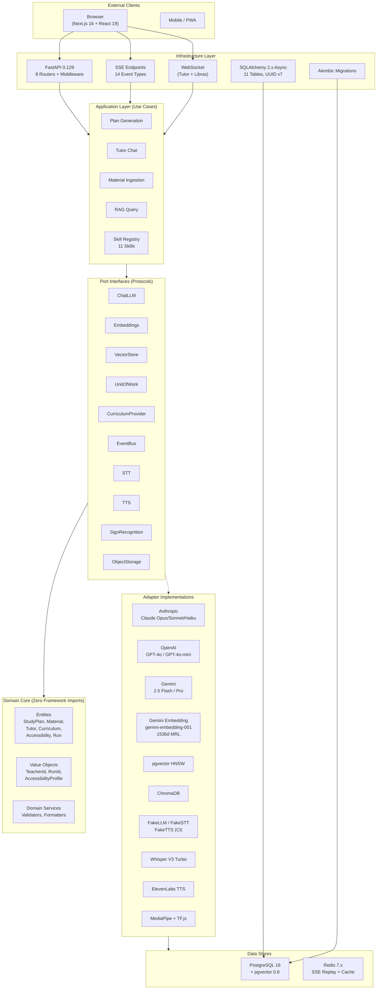
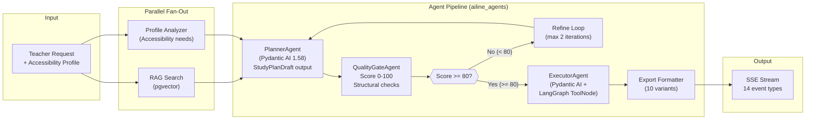
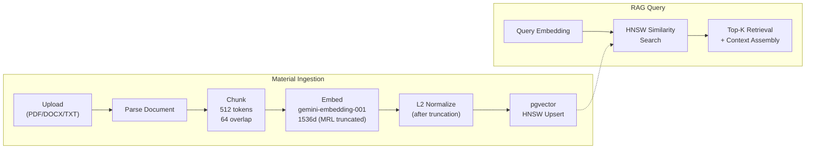
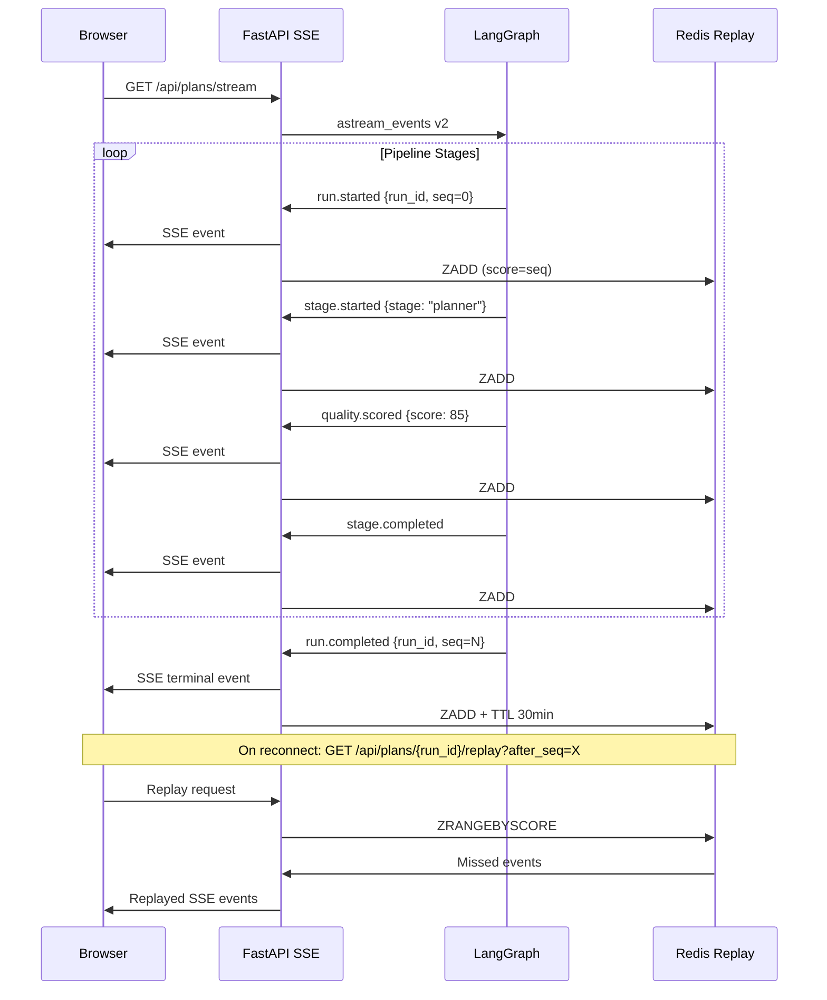
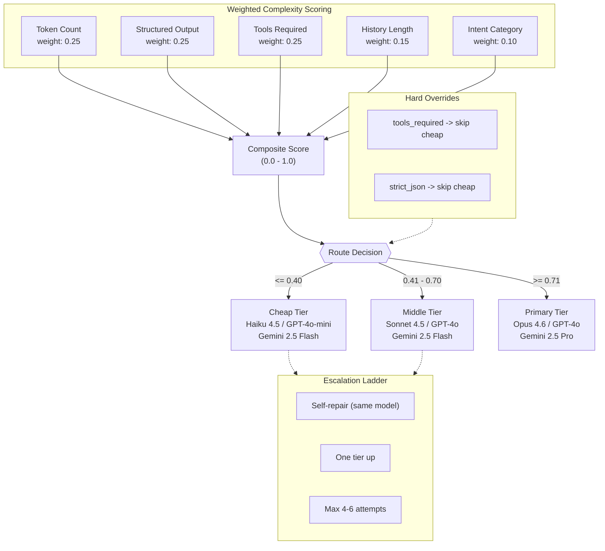
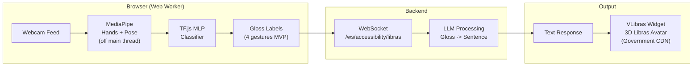
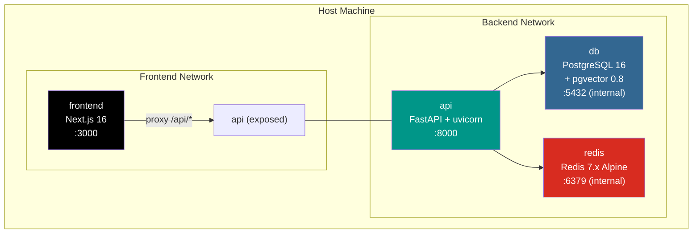
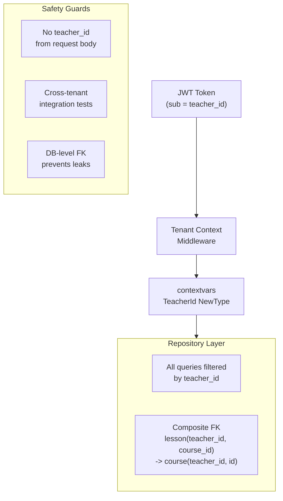

# AiLine Architecture Diagram

## 1. Hexagonal Architecture (Ports-and-Adapters)

## 2. Agent Pipeline (LangGraph + Pydantic AI)

## 3. RAG Pipeline

## 4. SSE Streaming Architecture

## 5. Multi-LLM SmartRouter

## 6. Sign Language Pipeline

## 7. Docker Compose Topology

## 8. Tenant Isolation Model

