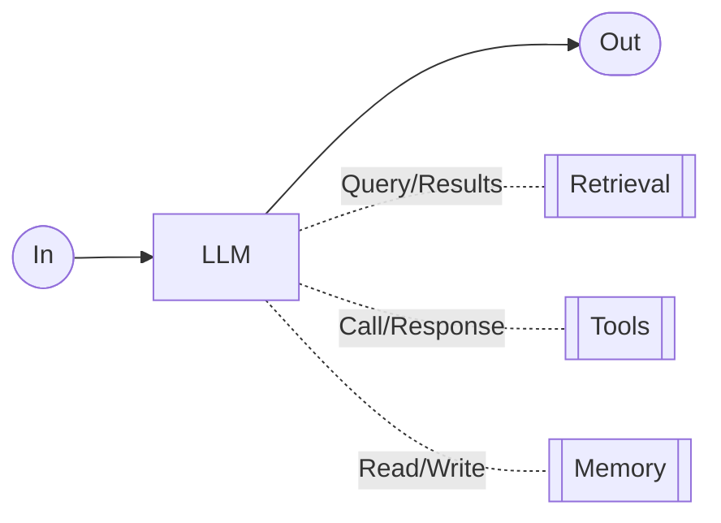
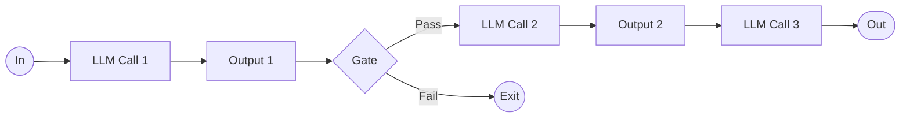
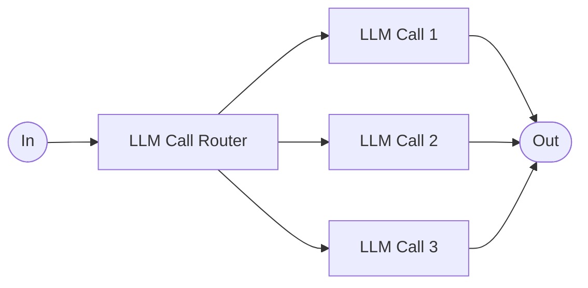
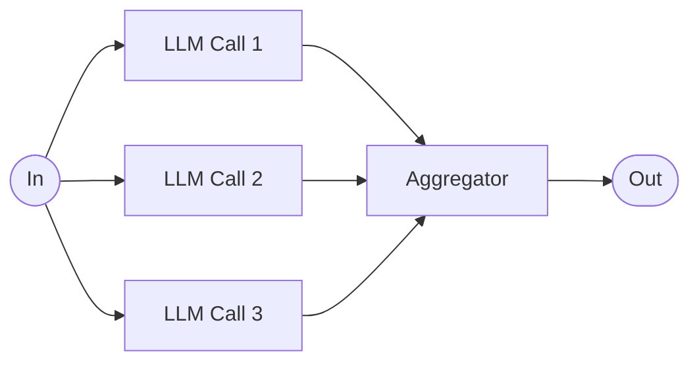
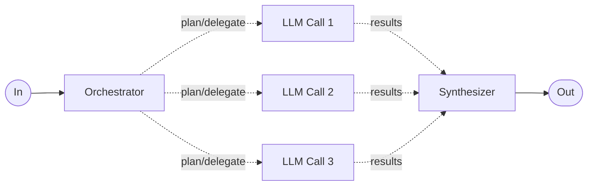
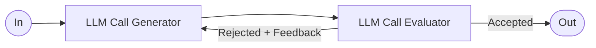
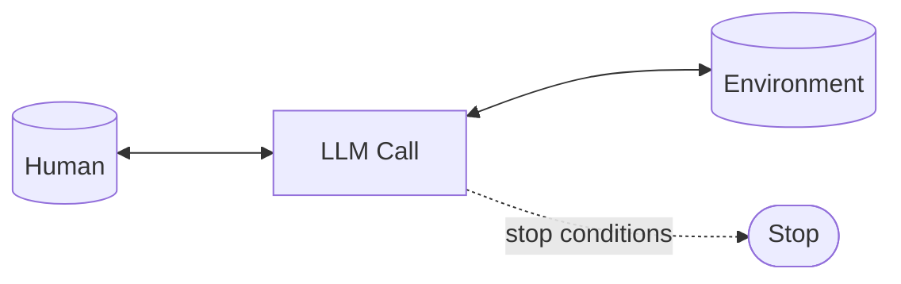
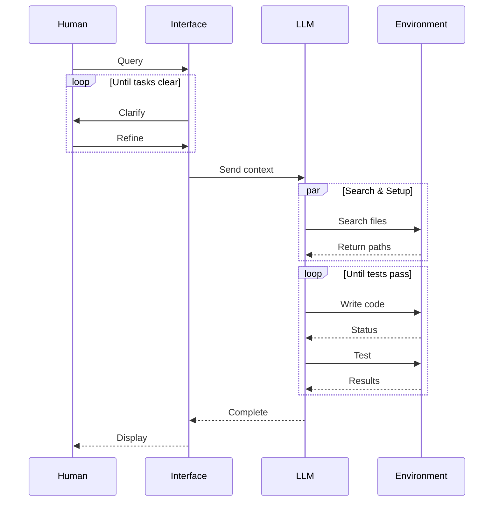

# Building Effective Agents —  Anhtropic

**Reference (full article):** [https://www.anthropic.com/engineering/building-effective-agents](https://www.anthropic.com/engineering/building-effective-agents)

---

## Table of Contents

* [1. Overview & Core Definitions](#1-overview--core-definitions)
* [2. When (and When Not) to Use Agents](#2-when-and-when-not-to-use-agents)
* [3. Frameworks vs Direct API](#3-frameworks-vs-direct-api)
* [4. Foundational Building Block: The Augmented LLM](#4-foundational-building-block-the-augmented-llm)

  * [4.1 Diagram & Markdown Flow](#41-diagram--markdown-flow)
  * [4.2 Practical Design Notes](#42-practical-design-notes)
* [5. Workflow Patterns](#5-workflow-patterns)

  * [5.1 Prompt Chaining](#51-prompt-chaining)
  * [5.2 Routing](#52-routing)
  * [5.3 Parallelization (Sectioning & Voting)](#53-parallelization-sectioning--voting)
  * [5.4 Orchestrator–Workers](#54-orchestratorworkers)
  * [5.5 Evaluator–Optimizer](#55-evaluatoroptimizer)
* [6. Agents (Autonomous Loops with Human & Environment)](#6-agents-autonomous-loops-with-human--environment)

  * [6.1 Coding-Agent Lifecycle (Swimlane)](#61-coding-agent-lifecycle-swimlane)
* [7. Combining & Customizing Patterns](#7-combining--customizing-patterns)
* [8. Implementation Playbook](#8-implementation-playbook)

  * [8.1 Planning & Transparency](#81-planning--transparency)
  * [8.2 Tooling/ACI (Agent–Computer Interface) Checklist](#82-toolingaci-agentcomputer-interface-checklist)
  * [8.3 Retrieval & Memory Strategy](#83-retrieval--memory-strategy)
  * [8.4 Observability, Evals, & Metrics](#84-observability-evals--metrics)
  * [8.5 Safety, Guardrails, & Risk Controls](#85-safety-guardrails--risk-controls)
  * [8.6 Cost, Latency, and Reliability Management](#86-cost-latency-and-reliability-management)
* [9. Pattern “How-Tos” (Concise Recipes)](#9-pattern-how-tos-concise-recipes)
* [10. Common Failure Modes & Fixes](#10-common-failure-modes--fixes)
* [11. Appendices](#11-appendices)

  * [A. Flow Diagrams (Mermaid + ASCII)](#a-flow-diagrams-mermaid--ascii)
  * [B. Prompt Snippets](#b-prompt-snippets)
  * [C. Rollout & Testing Plan](#c-rollout--testing-plan)

---

## 1. Overview & Core Definitions

* **Workflows:** predetermined code paths that call LLMs and tools in a fixed sequence. Predictable and consistent for well-defined tasks.
* **Agents:** LLM-driven processes that **decide** which tools to call and what to do next. Flexible, adaptive, and capable of recovering from errors—at the cost of higher latency and spend.

**Guiding principle:** start simple; add agentic complexity **only when it measurably improves outcomes**.

---

## 2. When (and When Not) to Use Agents

Use **single LLM calls** (with retrieval and examples) if they meet your quality bar.
Escalate to **workflows** when a task decomposes cleanly into steps.
Choose **agents** when:

* Steps are variable/unknown up front.
* You need model-driven planning and tool selection.
* The environment’s “ground truth” (APIs, code execution, tests) can validate progress.

Trade-offs: autonomy improves task performance but increases **latency, cost, and risk of error compounding**. Always add **stopping conditions**, budgets, and sandboxes.

---

## 3. Frameworks vs Direct API

* Frameworks (e.g., LangGraph, Bedrock Agents, Rivet, Vellum) reduce boilerplate but hide prompts/traces and can tempt over-engineering.
* Prefer **direct API** first. If you adopt a framework, **understand the underlying code paths** and keep visibility into prompts, tool schemas, and traces.

---

## 4. Foundational Building Block: The Augmented LLM

An **augmented LLM** has three capabilities:

1. **Retrieval** (query corpora/KBs)
2. **Tools** (call external APIs/actions)
3. **Memory** (read/write long-lived or session state)

### 4.1 Diagram & Markdown Flow

**Image (file reference):** `cd907b83-9f6f-4029-bdef-c542db59f31b.png`


**Mermaid (flow equivalent):**



**ASCII (fallback):**

```
In --> [LLM] --> Out
          |  \       \
          |   \       \-- Memory (Read/Write)
          |    \-- Tools (Call/Response)
           \-- Retrieval (Query/Results)
```

### 4.2 Practical Design Notes

* Give the LLM a **clear interface**: concise tool names, unambiguous parameters, examples, and boundaries.
* **MCP** (Model Context Protocol) is a practical way to standardize connections to third-party tools and data.
* Keep augmentations **task-specific**: don’t expose tools the agent shouldn’t use.

---

## 5. Workflow Patterns

### 5.1 Prompt Chaining

Break a task into **ordered steps**. Insert **gates** between steps to validate intermediate outputs.

**Image (file reference):** `53233e97-2078-4282-83bf-6245151326ce.png`


**Mermaid:**



**Use when:** a task decomposes cleanly; you’re willing to trade latency for higher accuracy.
**Examples:** outline → check → write; copy → QA → translate.
**Keys:** write objective **gate criteria**; cache intermediate artifacts.

---

### 5.2 Routing

Classify input, then send to the best specialist prompt/tools/model.

**Image (file reference):** `d5e9d07e-1fd7-4b21-a8a7-eb3b23f3c699.png`


**Mermaid:**



**Use when:** distinct categories benefit from different prompts/tools/models.
**Examples:** refund vs tech-support vs FAQ; small vs large model routing.
**Keys:** define **confusion matrix**, fallback behavior, and confidence thresholds.

---

### 5.3 Parallelization (Sectioning & Voting)

Run multiple calls **concurrently** and aggregate.

**Image (file reference):** `8251fc99-a7e9-4982-ae6c-a5fb1f6bd8cb.png`


**Mermaid:**



**Use when:** subtasks are independent (speed), or you want diversity (confidence).
**Examples:** multi-aspect evals; guardrails separated from task; N-shot code review.
**Keys:** choose aggregation (majority, weighted, rank-fusion), deduplicate, reconcile conflicts.

---

### 5.4 Orchestrator–Workers

An **orchestrator** plans dynamically, spawns workers, and synthesizes results.

**Image (file reference):** `ca662935-355f-4c19-bcd7-2905f4641494.png`


**Mermaid:**



**Use when:** subtasks are unknown up front (e.g., code changes across many files).
**Keys:** maintain **task ledger**, dedupe subtasks, and explicitly **stop** when acceptance is met.

---

### 5.5 Evaluator–Optimizer

One call **generates**, another **evaluates & feeds back** in a loop.

**Image (file reference):** `4ba14974-259f-4ed2-957a-5cf40a29476f.png`


**Mermaid:**



**Use when:** clear eval criteria exist and iterative refinement helps (e.g., translation polish, multi-round research).
**Keys:** keep the **rubric explicit**, cap iterations, log all revisions.

---

## 6. Agents (Autonomous Loops with Human & Environment)

Agents clarify the task, **plan → act → observe** via tools or execution, and may pause for feedback. Always use **environment ground truth** (API results, code/tests) to assess progress and avoid hallucinated state.

**Image (file reference):** `6b81dc5a-933e-4781-8fa1-caf637dea9ec.png`


**Mermaid:**



### 6.1 Coding-Agent Lifecycle (Swimlane)

**Image (file reference):** `96cb3c6a-3f95-46d2-9d7a-f72e205de697.png`


**Mermaid (sequence):**



---

## 7. Combining & Customizing Patterns

Patterns are **lego bricks**. Typical composites:

* Router → Specialized Chains
* Orchestrator → (Parallel sectioning) → Synthesizer
* Generator ↔ Evaluator embedded **inside** each chain step
* Agent loop that **invokes** routing and parallelization opportunistically

Always **measure**: adopt complexity only when it **wins** on your metrics.

---

## 8. Implementation Playbook

### 8.1 Planning & Transparency

* Surface the **plan** (subtasks, chosen tools, halting conditions) to users.
* Log **reasoning artifacts** you can safely expose: checklist, attempted tools, constraints, blockers.
* Provide **resume-from-checkpoint** to avoid retracing (state journal).

### 8.2 Tooling/ACI (Agent–Computer Interface) Checklist

* **Clear names & docstrings**; avoid synonym collisions across tools.
* **Minimal, typed parameters** with examples and edge cases.
* Prefer **easy-to-emit formats** (e.g., code in markdown, not JSON-escaped; file edits by full content unless a diff is trivial).
* Enforce **poka-yoke**: absolute paths, enums, validation rules.
* Include **dry-run**/`check` actions and **idempotency keys** for external effects.
* Return **structured results** plus a brief human-readable summary.

### 8.3 Retrieval & Memory Strategy

* Retrieval: chunking, re-ranking, freshness boosts; cite sources; avoid over-stuffing context.
* Memory: **ephemeral vs durable**; TTLs; privacy/PII rules; summarization for long-running tasks; **task-scoped state** vs **user-profile state**.

### 8.4 Observability, Evals, & Metrics

* Tracing: prompts, tool calls, latencies, errors, decisions.
* **Automated evals** (pass@k, factuality, success rate, containment/guardrail tests).
* **Canary runs** and shadow traffic; regression suites for prompts/tools.

### 8.5 Safety, Guardrails, & Risk Controls

* Pre-/post-filters; content policy checks; rate limits; budget caps; kill switches.
* **Stop conditions**: max iterations, max spend, deadline wall-clock.
* **Human-in-the-loop checkpoints** for high-risk actions.

### 8.6 Cost, Latency, and Reliability Management

* Dynamic routing (small vs large model), **early-exit gates**, caching.
* Retries with backoff; circuit breakers; degraded modes if a tool is down.
* Batch parallelizable steps; stream partials for UX responsiveness.

---

## 9. Pattern “How-Tos” (Concise Recipes)

**Prompt Chaining**

1. Define steps + acceptance for each step.
2. Implement gates with **objective checks**.
3. Cache outputs; expose trace to user; stop on failure.

**Routing**

1. Decide categories; create small, distinct prompts.
2. Train/define classifier (LLM or heuristic).
3. Add confidence thresholds and fallback path.

**Parallelization**

1. Choose sectioning vs voting.
2. Normalize outputs; aggregate (majority, rank-fusion, learned re-ranker).
3. Reconcile conflicts; log dissenting views.

**Orchestrator–Workers**

1. Orchestrator builds/updates task list.
2. Spawn workers with **minimal specific prompts**.
3. Synthesize; verify acceptance; de-duplicate; halt.

**Evaluator–Optimizer**

1. Write a **rubric** (criteria, weights).
2. Generator produces; evaluator scores + feedback.
3. Iterate with cap; store best artifact and rationale.

**Agents**

1. Clarify → plan → act → observe **ground truth**.
2. Periodic checkpoints + budgets + halting criteria.
3. Sandbox; promote after evals meet bar.

---

## 10. Common Failure Modes & Fixes

* **Ambiguous tools.** Fix: rename, narrow scope, add examples, enforce enums.
* **Hallucinated state.** Fix: force reads from environment/tools; never assume success without result checks.
* **Endless loops.** Fix: max iterations, budget caps, “no-progress” detector.
* **Flaky routing.** Fix: thresholds, backoffs, hybrid rules + LLM.
* **Prompt overfitting.** Fix: diverse eval sets; cross-domain tests.
* **Cost spikes.** Fix: cache, early exits, smaller models for easy paths.
* **Latency cliffs.** Fix: parallelize, batch, stream partials, prewarm tools.

---

## 11. Appendices

### A. Flow Diagrams (Mermaid + ASCII)

All diagrams above include Mermaid and ASCII versions inline with the section where they are relevant. Image files referenced:

1. `cd907b83-9f6f-4029-bdef-c542db59f31b.png` — Augmented LLM
2. `53233e97-2078-4282-83bf-6245151326ce.png` — Prompt Chaining with Gate
3. `d5e9d07e-1fd7-4b21-a8a7-eb3b23f3c699.png` — Router to Specialized Flows
4. `8251fc99-a7e9-4982-ae6c-a5fb1f6bd8cb.png` — Parallelization + Aggregator
5. `ca662935-355f-4c19-bcd7-2905f4641494.png` — Orchestrator–Workers + Synthesizer
6. `4ba14974-259f-4ed2-957a-5cf40a29476f.png` — Evaluator–Optimizer Loop
7. `6b81dc5a-933e-4781-8fa1-caf637dea9ec.png` — Autonomous Agent (HITL + Env)
8. `96cb3c6a-3f95-46d2-9d7a-f72e205de697.png` — Coding-Agent Swimlane

### B. Prompt Snippets

**Gate rubric (example)**

```
You are the GATE for step "<STEP_NAME>".
Accept only if ALL criteria are met:
1) Structural constraints (schema/length/sections)
2) Policy constraints (no PII; safe; compliant)
3) Task constraints (fulfills instructions X, Y, Z)
Return: {"pass": true|false, "reasons": [...], "fixes": [...]}
```

**Router prompt (example)**

```
Decide the best category for this input.
Categories: <A>, <B>, <C>.
Return JSON: {"category": "...", "confidence": 0..1, "rationale": "..."}.
```

**Evaluator feedback (example)**

```
Score on criteria {A:0-5,B:0-5,C:0-5}. Provide 2-4 targeted fixes.
Return JSON: {"scores":{"A":...,"B":...,"C":...},"accept":true|false,"feedback":[...]}
```

### C. Rollout & Testing Plan

1. **Prototype** with direct API, minimal tools.
2. Build **offline evals** and benchmark baselines.
3. Add **routing** and **gates**; re-benchmark.
4. Introduce **parallelization** or **orchestrator–workers** only if metrics improve.
5. Harden tools (poka-yoke), add **observability** and **safety** nets.
6. **Canary** in production with budgets; capture traces.
7. Iterate prompts/tools; lock a **versioned** config when stable.

