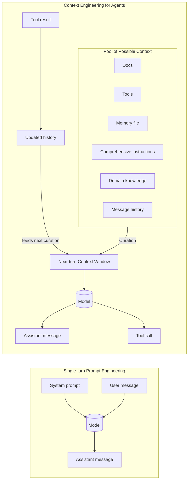
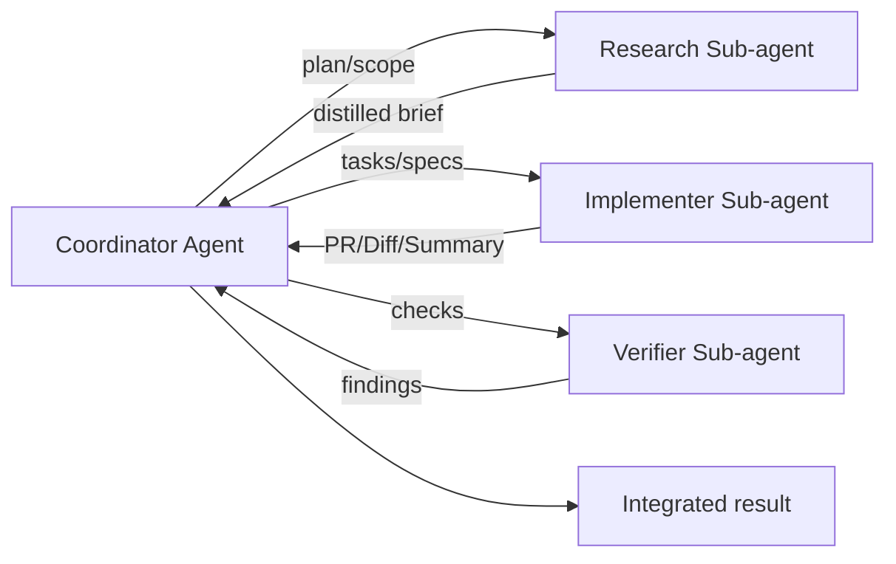

# Effective context engineering for AI agentes at Anthropic

**Reference (full article):** [https://www.anthropic.com/engineering/effective-context-engineering-for-ai-agents](https://www.anthropic.com/engineering/effective-context-engineering-for-ai-agents)
*Published Sep 29, 2025*

Context is a critical but finite resource for AI agents. This document consolidates and expands the original guidance into a thorough, implementation-oriented handbook—with textual diagrams that mirror the two images you provided and extensive checklists, patterns, and templates.

---

## 1) Context engineering vs. prompt engineering

**Core idea.** Prompt engineering optimizes *phrasing* for one-shot tasks; **context engineering** optimizes the *entire set of tokens* passed each turn—system instructions, tools, MCP endpoints, domain documents, message history, and memory—curated to fit within a limited context window.

### Figure A — Prompt vs. Context (from `1ab2dad5-c34c-464e-8d6e-223a2b31108f.png`)

**What the image conveys (verbal):**

* **Left (prompt engineering):** one-turn chat ⇒ *System prompt + User message → Model → Assistant message*.
* **Right (context engineering for agents):** the agent selects (curates) a subset of *docs, tools, memory, instructions, domain knowledge, and message history* into the next turn’s **context window**. The model can both reply and **call tools**, whose **results** are fed back for future turns.

**Markdown flow (Mermaid):**



**ASCII fallback:**

```
[Pool: Docs | Tools | Memory | Instructions | Domain Knowledge | Msg History]
                               | (curation)
                               v
                  [Context Window for Next Turn]
                     |                \
                     v                 v
                 (Model) --------> [Tool call]
                     |                  |
                     v                  v
           [Assistant message]     [Tool result] -> (history) -> curation loop
```

---

## 2) Why context engineering matters

* **Context rot:** longer inputs degrade accurate recall; treat context as a **scarce budget**.
* **Transformer attention:** every token can attend to every token; compute and capacity spread thin as `n` grows.
* **Training skew:** models observe far more short sequences than very long ones; long-range dependencies are weaker.
* **Longer windows help but don’t cure:** interpolation and scaling extend range but do not remove precision/relevance decay.
  **Implication:** aggressively curate for **high signal per token**.

---

## 3) The anatomy of effective context

### 3.1 System prompts (calibration and “altitude”)

**Goal:** the *minimal* set of information that fully specifies desired behavior—*minimal ≠ short*.

**Failure modes:**

* **Too specific:** brittle step-lists; hardcoded branches; high maintenance.
* **Too vague:** generic role; lacks operational heuristics; assumes shared context that isn’t present.

**“Goldilocks” prompt skeleton (copy/paste):**

```xml
<role>
  You are a <precise role> serving <users> to achieve <goals>.
</role>

<guardrails>
  - Safety/ethics boundaries in short bullets.
  - When unsure: ask; when blocked: escalate via <tool>.
</guardrails>

<capabilities>
  - Tools available: <tool_1 brief>, <tool_2 brief>, ...
  - Data: <docs or stores>.
</capabilities>

<response_framework>
  1) Identify request & success criteria.
  2) Retrieve/check facts with tools before asserting.
  3) Propose action with realistic next steps & timelines.
  4) Confirm understanding & handoff/summary.
</response_framework>

<outputs>
  - Format, fields, units, examples (one or two).
</outputs>
```

### Figure B — Calibrating the system prompt (from `ae011c74-6594-4511-95ef-0285642cb836.png`)

**What the image conveys (verbal):**
A spectrum: **Too specific** (brittle, exhaustive rules) → **Just right** (clear role, tool-aware workflow, compact steps + guidelines) → **Too vague** (non-actionable).

**Markdown visualization:**

```
Too specific |▮▮▮▮▮▮▮▮▮--- Just right ---▮▮▮▮▮▮▮▮▮| Too vague
  - brittle              - clear role & tools             - generic role
  - if/else jungle       - 4-step response framework      - "assist the brand"
  - overfit to cases     - concrete guidelines            - no decision cues
```

**Quick calibration checklist:**

* Does the prompt define **role, goals, authority, tools**?
* Does it include a **short response framework** (2–5 steps)?
* Are **outputs** specified with fields/examples?
* Could a new engineer replicate behavior with **only this text**? If not, add what’s missing—then cut fluff.

### 3.2 Tools (design & governance)

**Principles:**

* **Token-efficient returns:** concise fields; allow *range/limit*; support *streaming/chunking*.
* **Single responsibility:** each tool solves one thing well; avoid overlapping tools.
* **Clear affordances:** names and params reflect intent; document when *not* to use.

**Tool contract template (YAML):**

```yaml
name: find_orders
description: Retrieve orders by id or status with small, typed payloads.
inputs:
  order_id: {type: string, required: false}
  status:   {type: enum[open,closed,cancelled], required: false}
  limit:    {type: int, default: 10, min: 1, max: 50}
returns:
  - id: string
  - created_at: iso8601
  - status: string
  - total: number
notes:
  - Prefer `order_id` over `status` when available.
  - Never return full line-items unless `expand=line_items`.
```

**Governance:**

* Keep a **tool registry** (table of purpose, inputs, outputs, examples).
* Run **canary prompts** after each tool update.
* Add **rate limits/backoff** and **retries with idempotency keys**.

### 3.3 Examples (few-shot)

* Include **2–5 canonical** demonstrations; avoid laundry lists.
* Choose **diverse** cases that show boundary behavior and desired tone.
* Prefer **structured outputs** (JSON/XML snippets).

### 3.4 Message history and memory

* **History:** keep *recent turns* and any **open decisions**; prune raw tool dumps.
* **Memory:** externalize durable facts (project state, decisions, glossary) to **file-based notes** (e.g., `NOTES.md`, `DECISIONS.md`) and pull in slices when relevant.

---

## 4) Context retrieval & agentic search

**Definition:** Agents are **LLMs autonomously using tools in a loop**.

**Two modes:**

1. **Pre-inference retrieval (RAG)** — fast, static slices; good when queries are predictable.
2. **Just-in-time (JIT) retrieval** — dynamic, tool-driven exploration; slower but more precise/contextual.

**Hybrid pipeline (recommended):**

```mermaid
flowchart TD
  Q[User task] --> P0[Minimal prompt + seed context]
  P0 --> R1[Pre-retrieval (embeddings/filters)]
  R1 --> C0[Curation v1]
  C0 --> M[(LLM)]
  M --> D1{Need more info?}
  D1 -- yes --> JT[JIT tools (search/query/fs)]
  JT --> C1[Curation v2 (focused slices)]
  C1 --> M
  D1 -- no --> OUT[Result + optional tool calls]
  OUT --> LOG[Trace/notes for memory]
```

**Heuristics for switching to JIT:**

* Confidence below threshold;
* Retrieval overlaps too broadly;
* Tool budget allows exploration;
* Ambiguous fields or missing identifiers.

**Signal-per-token filters:**

* **Top-k by MMR** (diversity) not just cosine similarity;
* **Windowed quoting** (only surrounding spans);
* **Schema projection** (map to required fields only).

---

## 5) Long-horizon tasks

### 5.1 Compaction (conversation summarization & restart)

**When:** token usage approaches threshold; history becomes noisy.

**Algorithm sketch:**

```pseudo
if context_tokens > threshold or "end of phase":
  summary = LLM.summarize(history, preserve=[
    "architectural decisions",
    "open questions/todos",
    "constraints/acceptance criteria",
    "links/ids needed to resume"
  ], drop=["raw tool dumps", "duplicate outputs"])
  new_context = [system_prompt, summary, last_5_files, current_task]
  continue()
```

**Tuning:** maximize **recall** first (don’t lose critical facts), then improve **precision** (remove superfluous content).
**Low-risk compaction:** clear tool results older than *N* turns unless referenced by an open item.

### 5.2 Structured note-taking (agentic memory)

**Pattern:** agent maintains durable notes outside the window; rereads on resume.

**Practical schemas:**

```yaml
NOTES.md:
  - Open decisions: <id, owner, due, context>
  - Glossary: <term -> short definition>
  - Milestones: <name, status, link>
DECISIONS.md:
  - ADR-001: Decision, Rationale, Implications, Date
TODO.md:
  - [ ] Item (owner) (link to trace) (status)
```

**Fetch policy:**

* Always load **DECISIONS.md**.
* Load **NOTES.md sections** by tag (e.g., `#phase:research`).
* Append a **turn summary** (1–3 bullets) at the end of each loop.

### 5.3 Sub-agent architectures

**When:** tasks split naturally (research vs. implementation), or domain tools require specialized handling.

**Coordinator pattern:**



**Contract:** each sub-agent returns **1–2k tokens**: assumptions, steps taken, artifacts, open risks—*no raw logs unless requested*.

---

## 6) Putting it together: the context budget playbook

**Per turn:**

1. **Plan first** (1–3 bullets): goal, missing info, chosen tools.
2. **Assemble context**: system prompt + minimal history + selected docs + memory slices + just the tools you’ll use.
3. **Act**: call tools with narrow params (limit fields/rows).
4. **Evaluate**: did we get closer? If not, branch to JIT exploration.
5. **Summarize**: append a turn-summary and refresh memory files.
6. **Compact** when: token usage high, phase completed, or noise accumulates.

**Stop conditions:** acceptance criteria met; tool results stable; verifier approves.

---

## 7) Measurement & observability

* **Token efficiency:** tokens per successful outcome; target **downward trend**.
* **Retrieval quality:** gold-label evals for **precision/recall@k** and **MMR diversity**.
* **Tool ROI:** success rate per tool; timeouts; error taxonomies; average payload bytes.
* **Compaction efficacy:** post-compaction success vs. without compaction; loss-of-signal incidents.
* **Cost & latency:** tokens × price + tool latencies; budget guards.
* **Safety:** red-team scenarios; escalation to humans on low-confidence or restricted actions.

---

## 8) Anti-patterns to avoid

* **Overstuffed context:** “include everything just in case.”
* **Ambiguous tools:** two tools with overlapping purposes.
* **Monolithic prompts:** giant system prompts with hidden rules instead of clear frameworks.
* **Stale indices:** relying solely on pre-built embeddings when the corpus is volatile.
* **No memory discipline:** losing decisions across sessions; repeating work.
* **Unbounded loops:** no stop criteria; no verifier stage.

---

## 9) Templates & snippets

### 9.1 “Just-right” system prompt for a support agent

```xml
<role>You are a customer support agent for <Company>. Resolve issues quickly and professionally using available tools.</role>
<capabilities>Tools: order_db.lookup, policy.get, human_escalate.</capabilities>
<response_framework>
1) Identify the core issue and success criteria.
2) Verify facts with tools (orders/policies).
3) Provide resolution and concrete next steps with realistic timelines.
4) Confirm understanding and how to follow up.
</response_framework>
<outputs>Return: {summary, steps, links, confirmation_required?: boolean}</outputs>
<guardrails>Use human_escalate for legal, medical, or emergency situations.</guardrails>
```

### 9.2 Tool registry table (example)

| Tool              | Purpose                       | Key Inputs                     | Returns (columns)                    | Notes                                |
| ----------------- | ----------------------------- | ------------------------------ | ------------------------------------ | ------------------------------------ |
| `order_db.lookup` | Fetch order summary           | `order_id` | `status`, `limit` | `id`, `date`, `status`, `total`      | Prefer `order_id` if present         |
| `policy.get`      | Fetch policy by topic/version | `topic`, `version?`            | `title`, `url`, `version`, `excerpt` | Cite excerpts only; avoid full dumps |
| `human_escalate`  | Handoff to human              | `reason`, `details`            | `ticket_id`                          | Use for exceptions/special approvals |

### 9.3 Compaction prompt (starter)

```text
Summarize the following trace to preserve:
- decisions, rationales, constraints, IDs/links
- unresolved questions and explicit next actions
- the minimal facts needed to resume

Remove:
- raw multi-page tool outputs
- duplicated or superseded content

Return sections: DECISIONS, OPEN_QUESTIONS, FACTS_TO_RETAIN, NEXT_ACTIONS.
```

---

## 10) Security, privacy, and compliance

* **Data minimization:** include only necessary PII and redact when not required.
* **Access control:** tools enforce auth; log calls; scrub secrets in traces.
* **Retention:** rotate and expire memory files; encrypt at rest; sign artifacts.
* **Provenance:** track inputs (doc hashes, tool versions) in outputs.
* **Human-in-the-loop:** explicit gates for high-risk actions.

---

## 11) Domain adaptations (examples)

* **Legal/finance:** heavier **pre-retrieval** (versioned references) + selective JIT for recent filings; strong provenance.
* **Data analysis:** JIT with sampling (`head`, `tail`, `LIMIT`) and **query planning** before full scans.
* **Coding:** hybrid—seed with `CLAUDE.md`/README/ADR; navigate via `glob`, `grep`, and targeted diffs.

---

## 12) Image references (as requested)

* **Figure A:** *Prompt engineering vs. context engineering* — file **`1ab2dad5-c34c-464e-8d6e-223a2b31108f.png`**.
* **Figure B:** *Calibrating the system prompt* — file **`ae011c74-6594-4511-95ef-0285642cb836.png`**.

Both figures are represented above with textual/mermaid diagrams and integrated explanations at the appropriate sections.

---

## 13) Conclusion

Context engineering reframes the problem from “write the perfect prompt” to **“curate the smallest high-signal set of tokens each turn.”** Use calibrated system prompts, a lean toolset, canonical examples, hybrid retrieval, compaction, durable notes, and sub-agents. Measure relentlessly, prune often, and treat context as a **precious, finite budget**.
