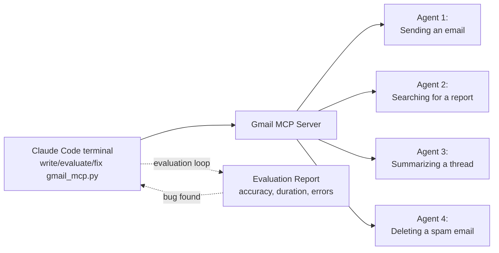

**Reference:** [https://www.anthropic.com/engineering/writing-tools-for-agents](https://www.anthropic.com/engineering/writing-tools-for-agents)

# Writing effective tools for agents — with agentes (ANTHROPIC)

*Published Sep 11, 2025*

Agents are only as effective as the tools we give them. This guide explains how to prototype, evaluate, and iteratively improve tools for agentic systems—and how to use Claude to optimize tools for itself. You’ll find end-to-end recipes, design patterns, and text-only diagrams that mirror the supplied images.

---

## Figures (images + text drawings)

### Figure 1 — “Collaborating with Claude Code”


*File:* **bd00685a-d8bc-4e50-a445-f2d7658b37ac.png*

**Text drawing (flow):**

```
[Developer in Claude Code (terminal)]
    ├─ Write(file_path: gmail_mcp.py) → "Wrote 1,219 lines"
    ├─ Run evaluation: Bash(python evaluate_mcp.py)
    │    └─ # Evaluation Report → Accuracy: 85.0%, Avg Task: 15.77s, …(+291 lines)
    ├─ Detect bug: "send_email" tool
    └─ Fix bug → Write(23 lines to gmail_mcp.py)
                         │
                         ▼
                 [Gmail MCP Server / Tools]
                         │
         ┌───────────────┼───────────────┬─────────────────┐
         ▼               ▼               ▼                 ▼
 [Agent 1: Send email] [Agent 2: Search] [Agent 3: Summarize] [Agent 4: Delete spam]
```

**Mermaid version (optional):**



---

### Figure 2 — “Slack tools: held-out test accuracy”


*File:* **493da683-7b66-47a3-8142-f3907544eaae.png*

**Text drawing (bar chart approximation):**

```
Slack tools — Test-Set Accuracy

Human-written MCP server    |███████████████████████............| 67.4%
Claude-optimized MCP server |███████████████████████████████....| 80.1%
(█ ≈ 2% — dots to 100%)
```

**Tabular reproduction:**

| Variant                     | Test-Set Accuracy |
| --------------------------- | ----------------- |
| Human-written MCP server    | 67.4%             |
| Claude-optimized MCP server | 80.1%             |

---

### Figure 3 — “Asana tools: held-out test accuracy”


*File:* **cdfd88f5-2e57-4559-8b75-62cacef9517a.png*

**Text drawing (bar chart approximation):**

```
Asana tools — Test-Set Accuracy

Human-written MCP server    |█████████████████████████████......| 79.6%
Claude-optimized MCP server |████████████████████████████████...| 85.7%
```

**Tabular reproduction:**

| Variant                     | Test-Set Accuracy |
| --------------------------- | ----------------- |
| Human-written MCP server    | 79.6%             |
| Claude-optimized MCP server | 85.7%             |

---

## What is a “tool” (for agents)?

* **Deterministic software**: same output for the same input (e.g., `getWeather("NYC")`).
* **Agents**: non-deterministic policies; they may ask clarifying questions, select between tools, or hallucinate.
* **Tools for agents** are contracts between deterministic services (APIs, DBs, microservices) and non-deterministic planners (LLMs).
  Designing tools *for agents* requires:

  * High-signal outputs that minimize wasted context,
  * Clear purpose and boundaries,
  * Ergonomic APIs that match natural task decompositions.

---

## How to write tools (end-to-end)

### 1) Build a quick prototype

* **Authoring**: Draft one or more tools; if using Claude Code, provide library/API docs (including MCP SDK) as flat, LLM-friendly references.
* **Packaging**: Wrap tools in a **local MCP server** or **Desktop Extension (DXT)** to exercise them in Claude Code or Claude Desktop.
* **Wiring**

  * Claude Code → local MCP: `claude mcp add <name> <command> [args...]`
  * Claude Desktop → Settings ▸ Developer (servers) / Settings ▸ Extensions (DXTs)
* **Programmatic testing**: Pass tools directly via API for scripted trials.
* **Dogfooding**: Run typical tasks; collect human feedback on rough edges.

### 2) Create a realistic evaluation

Build many tasks that mirror production workflows, not toy sandboxes. Prefer tasks that require **multi-step, multi-tool** strategies.

**Strong task examples**

* “Schedule a meeting with Jane next week; attach last planning notes; reserve a room.”
* “Customer 9182 was triple-charged; find all relevant logs; check if others were affected.”
* “Customer Sarah Chen requested cancellation; draft best retention offer; identify risks.”

**Weaker tasks**

* “Schedule Jane next week.”
* “Search logs for `purchase_complete` and `customer_id=9182`.”
* “Find cancellation for ID 45892.”

**Verifiers**

* From exact string checks to rubric-based LLM judging.
* Avoid brittle verifiers that fail on formatting/valid paraphrases.
* Optionally log the **expected** tools per task (but don’t overfit; allow multiple valid strategies).

### 3) Run the evaluation (simple agent loop)

* One loop per task: `LLM ↔ tool(s)` until stop criteria.
* System prompt asks for:

  * **Structured response block** (for verification),
  * **Reasoning + feedback blocks** (to diagnose failures/omissions).
* Capture **metrics**: accuracy, tool errors, latency per tool, tokens, call counts.
* Use **held-out test sets** to check generalization.

**Pseudocode sketch**

```python
for task in eval_tasks:
    agent_state = init_state(task, tools)
    while not done(agent_state):
        llm_out = llm_call(agent_state.prompt, tools_schema)
        if llm_out.tool_call:
            result = call_tool(llm_out.tool_call)
            agent_state = agent_state.with_tool_result(result)
        else:
            agent_state = agent_state.with_completion(llm_out)
    score(task, agent_state.structured_response)
    log_metrics(agent_state.calls, agent_state.tokens, agent_state.errors)
```

### 4) Analyze the results

* **Where agents stall**: inspect reasoning/feedback blocks and raw transcripts.
* **Metrics patterns**

  * Many redundant calls → add pagination/range filters; tighten defaults.
  * Frequent param errors → clarify names/types; add examples; tighten validation.
  * Query quirks → refine tool descriptions (e.g., wrong default year in queries).

### 5) Collaborate with agents to refactor

Concatenate transcripts + results and paste into Claude Code to:

* Rewrite confusing tool descriptions/schemas,
* Consolidate overlapping tools,
* Align namespacing and parameter naming,
* Autogenerate test cases for newly fixed edge cases.

---

## Principles for effective tools

### A) Choose the *right* tools (less, but sharper)

* Avoid 1:1 endpoint wrappers that dump massive, low-signal data.
* Aim for **human-like decompositions** and **context efficiency**.

**Prefer these patterns**

* `search_contacts` / `message_contact` (not `list_contacts`).
* `search_logs` returning targeted snippets + context (not `read_logs` dumps).
* `schedule_event` that finds availability & creates events (not separate list/create tools).
* **Composite tools** that bundle common multi-step sequences and enrich outputs with relevant metadata.

**Checklist**

* Clear, distinct purpose
* High-impact workflow coverage
* Bounds on response size
* Strong defaults (filters, ranges, sorts)
* Minimal overlap with existing tools

### B) Namespace to prevent confusion

* Group tools by **service** and **resource**:

  * `asana_search`, `jira_search`
  * `asana_projects_search`, `asana_users_search`
* Prefix vs. suffix **matters**; evaluate which naming scheme improves selection for your LLM.
* Namespacing reduces the number of loaded descriptions and lowers error risk.

### C) Return **meaningful** context

* Prefer human-actionable fields: `name`, `image_url`, `file_type`, `title`, `created_at`, `url`.
* Resolve opaque IDs to interpretable language or simple indices when possible.
* When chaining follow-up calls needs IDs, expose a **response-format** switch:

```ts
enum ResponseFormat {
  DETAILED = "detailed",  // includes IDs (thread_ts, user_id, channel_id...)
  CONCISE  = "concise"    // text + salient metadata only
}
```

* Pick **response structure** empirically (JSON/XML/Markdown) per task; LLMs favor familiar formats.

### D) Optimize for token efficiency

* Implement **pagination**, **range selection**, **filters**, and **truncation** with sensible defaults.
* Encourage strategies like “many small targeted searches” vs. “one broad dump”.
* Make **errors helpful** (validation hints) vs. opaque tracebacks.

**Helpful error template**

```json
{
  "error": "invalid_parameter",
  "parameter": "start_date",
  "expected_format": "YYYY-MM-DD",
  "example": "2025-09-30",
  "next_steps": "Provide an ISO date or omit start_date to use default (last 7 days)."
}
```

### E) Prompt-engineer tool descriptions/specs

* Write like onboarding a new teammate:

  * Explain domain jargon and query formats,
  * Define relationships (e.g., thread ↔ replies via `thread_ts`),
  * Use unambiguous parameter names (`user_id`, `channel_id`, `max_results`).
* Enforce **strict schemas**; provide **good examples** and **counter-examples**.
* Measure small description changes—they can materially shift behavior.

---

## Engineering cookbook

### Tool spec template (JSON Schema excerpt)

```json
{
  "name": "search_logs",
  "description": "Search production logs and return only relevant lines with ±N surrounding lines.",
  "input_schema": {
    "type": "object",
    "required": ["query"],
    "properties": {
      "query": {"type": "string", "description": "Search expression (Lucene-like)."},
      "since": {"type": "string", "format": "date-time"},
      "until": {"type": "string", "format": "date-time"},
      "max_results": {"type": "integer", "minimum": 1, "maximum": 500, "default": 50},
      "context_lines": {"type": "integer", "minimum": 0, "maximum": 20, "default": 3},
      "response_format": {"type": "string", "enum": ["concise", "detailed"], "default": "concise"}
    }
  }
}
```

### Example composite tool: `schedule_event`

* Inputs: `title`, `participants[]`, `time_window`, `duration`, `location_pref`, `notes`, `constraints`.
* Behavior: finds mutual availability → reserves room/video link → creates calendar entry → returns human-readable summary + event URL (+ IDs only if `response_format="detailed"`).

### System prompt fragment for evaluation agents

```
You are an evaluation agent. For each task:
1) Think step-by-step and write a short FEEDBACK block (what is unclear, what tool you need, expected inputs).
2) Emit at most one TOOL_CALL per step with validated parameters.
3) After tools finish, produce a STRUCTURED_RESULT block (JSON) that the verifier can check.
4) Keep tool calls minimal and token-efficient (paginate, filter, narrow).
```

### Observability & quality gates

* **Metrics**: accuracy, pass@k, tool error rate, average tool latency, tokens in/out, tool calls per task.
* **Logs**: full transcripts (prompt, tool calls, results), redacted PII where required.
* **Tests**: unit (schemas/validators), integration (tool ↔ system), E2E (multi-tool workflows), regression (frozen eval sets).
* **Safety**: destructive tools flagged/annotated; dry-run support; confirmation requirements; audit trails.

### MCP server patterns

* **Isolation**: per-tool rate limits and timeouts; retries with backoff.
* **Idempotency**: request IDs; safe replays.
* **Caching**: memoize expensive reads; validate freshness windows.
* **Backpressure**: 429 → steer agent to narrower queries.
* **Least privilege**: scoped tokens; server-side filtering; redact sensitive fields by default.
* **Annotations**: mark tools that require open-world access or perform irreversible actions.

---

## Putting it all together (step-by-step)

1. **Pick 3–7 high-impact workflows** and define tools that match human task decomposition.
2. **Implement** with strict schemas, clear namespacing, strong defaults, and response verbosity control.
3. **Wrap in MCP** and hook into Claude Code/Claude Desktop; **dogfood** manually.
4. **Author 50–200 evaluation tasks** drawn from real data/services; include edge cases.
5. **Run agentic loops**; log transcripts + metrics; build a **held-out test set**.
6. **Analyze & refactor with Claude Code** (paste transcripts); consolidate tools; fix descriptions/schemas.
7. **Re-evaluate**; compare to baseline; watch token and latency budgets.
8. **Harden** (tests, safety, observability) and **document** usage patterns and examples.
9. **Repeat** until held-out performance stabilizes and operational metrics meet SLOs.

---

## Looking ahead

Effective tools are **intentionally scoped**, **context-efficient**, **composable**, and **well-described**. With an evaluation-driven loop and collaboration with agents themselves, your tool ecosystem can evolve alongside MCP and underlying LLM advances.

