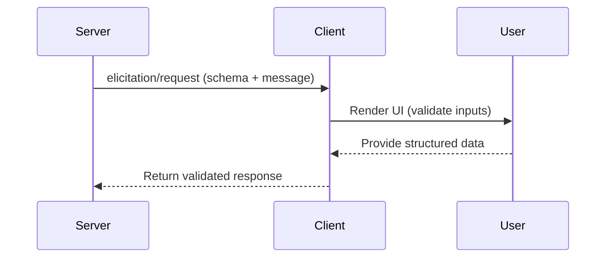
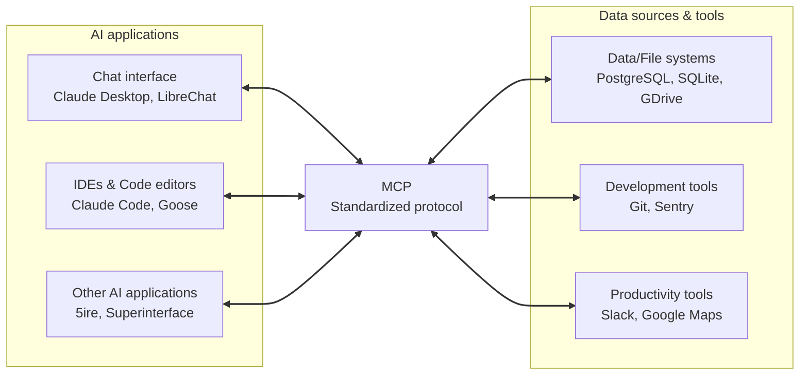
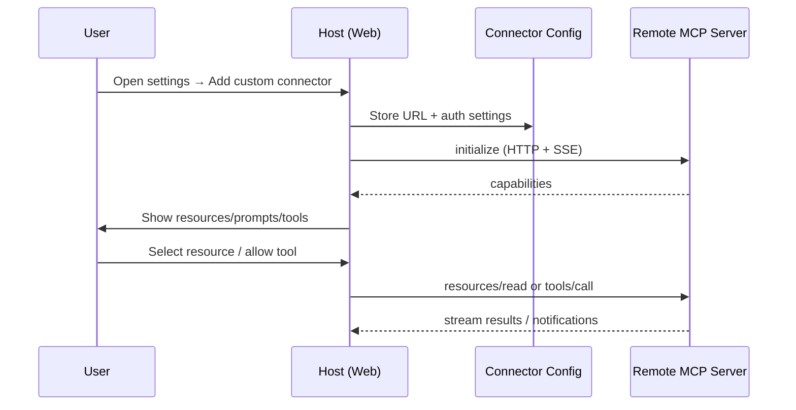
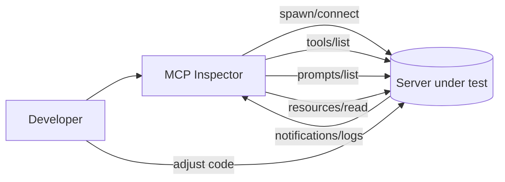
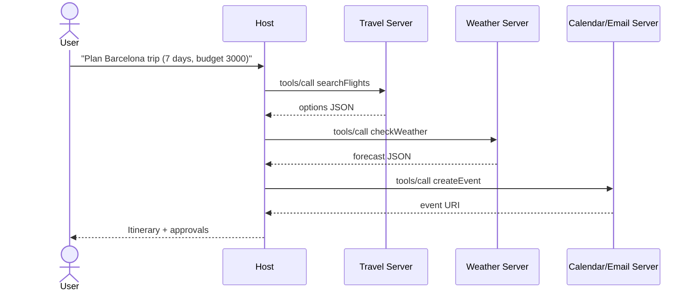
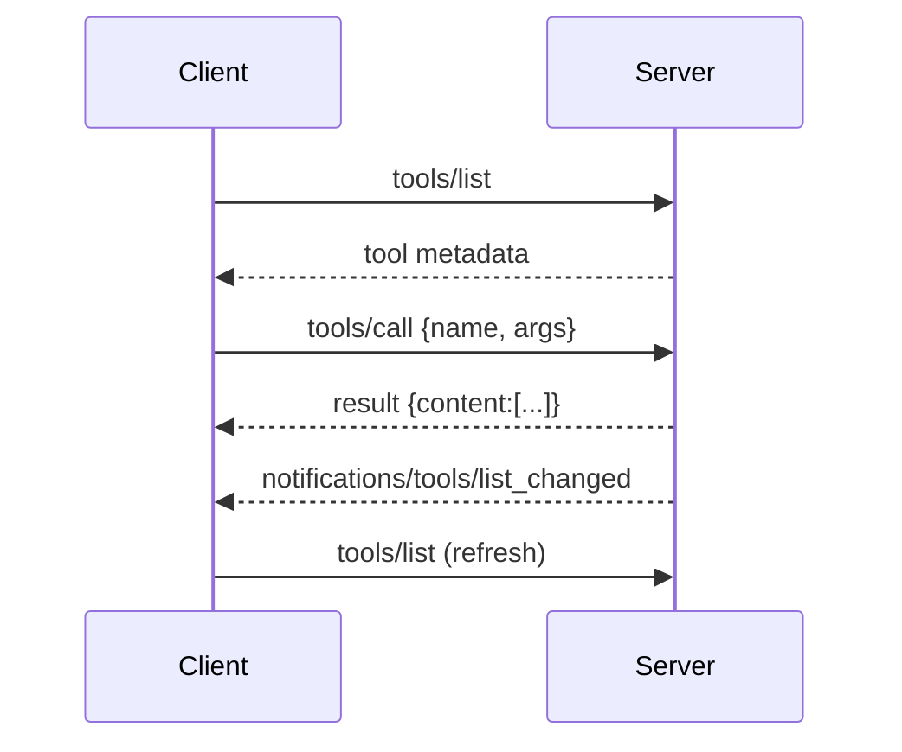

# Model Context Protocol (MCP) — Comprehensive Guide (Markdown-first)

Reference (single site; no inline citations elsewhere): https://modelcontextprotocol.io

> This document is intentionally exhaustive and self-contained. It avoids inline citations and external links beyond the single reference above. All flows that were originally shown as images are redrawn below using Markdown (Mermaid/ASCII) so you can copy, diff, and maintain them in docs and repos. Image descriptions include the **file name and extension**.

---

## Table of Contents
1. What is MCP?
2. Mental Model (USB-C for AI)
3. End-to-End Overview (High-Level Flow)
4. Architecture
   - Participants (Host, Client, Server)
   - Layers (Data, Transport)
5. Data Layer Protocol
   - Lifecycle & Capability Negotiation
   - Primitives (Tools, Resources, Prompts)
   - Client-side Primitives (Sampling, Elicitation, Logging, Roots)
   - Notifications & Progress
6. Transport Layer
   - STDIO
   - Streamable HTTP (incl. SSE)
7. Versioning & Negotiation
8. Security, Privacy & Permissions
9. Reliability & Operations
   - Timeouts, Retries, Backoff
   - Concurrency & Idempotency
   - Long-running Operations & Progress
   - Rate Limits & Flow Control
10. Performance & Scalability
11. Design Guidelines & Anti-Patterns
12. Building Servers (Python, Node, Java, Kotlin, .NET) — Minimal to Full Quickstarts
13. Building Clients (Python, Node, Java, Kotlin, .NET) — Control loop & tool routing
14. Flows (Markdown Diagrams)
    - Core MCP “bridge” diagram (redraw)
    - Local MCP servers with a desktop host
    - Remote MCP servers via custom connectors
    - Inspector-driven debugging loop
    - Multi-server orchestration (travel example)
    - Tool discovery → execution → notification refresh
15. Using Claude Desktop with Local MCP Servers (Filesystem)
16. Connecting Remote MCP Servers via Custom Connectors (Web)
17. MCP Inspector (Deep Debugging)
18. Testing & QA Checklist
19. Troubleshooting Playbook
20. Appendix: Canonical Schemas & Message Shapes
21. Image Catalog (with file names and descriptions)

---

## 1) What is MCP?

**Model Context Protocol (MCP)** is an open standard that lets AI applications connect to external systems through a consistent protocol. MCP formalizes how *context* (data, tools, prompts) flows between an AI **host** (e.g., a chat app or IDE) and one or more **servers** that expose capabilities.

**Key idea:** Instead of hard-coding one-off integrations, you add servers that expose *standard* primitives; the host discovers, lists, calls, and subscribes without custom glue per integration.

---

## 2) Mental Model (USB-C for AI)

Treat MCP like a **USB-C port for AI apps**:
- One standardized plug/socket (protocol) for many devices (servers)
- Hot-plug: hosts can connect/disconnect servers at runtime
- Capability negotiation ensures compatibility and safe operation

---

## 3) End-to-End Overview (High-Level Flow)

```mermaid
sequenceDiagram
    actor User
    participant Host as MCP Host (App)
    participant Client as MCP Client
    participant Server as MCP Server(s)

    User->>Host: Natural language request
    Host->>Client: Route request / check available tools & resources
    Client->>Server: list tools/resources/prompts (discovery)
    Server-->>Client: metadata (schemas, URIs, prompts)
    Host->>Host: Decide (LLM) whether to call tools
    Host->>Client: tools/call (with arguments)
    Client->>Server: Execute tool
    Server-->>Client: Structured result (content array)
    Client-->>Host: Return result as context
    Host-->>User: Final answer (augmented by tool results)
````

---

## 4) Architecture

### 4.1 Participants

* **MCP Host (AI application):** Orchestrates the experience. Spawns/coordinates one client per server.
* **MCP Client:** Maintains a *1:1 connection* to a specific server and handles the protocol.
* **MCP Server:** Exposes capabilities (tools, resources, prompts) to clients; runs local or remote.

**One-to-one topology per server**

```mermaid
graph LR
  subgraph Host [MCP Host]
    C1[Client → Server A]
    C2[Client → Server B]
    C3[Client → Server C]
  end
  S1[(Server A)]
  S2[(Server B)]
  S3[(Server C)]
  C1 --- S1
  C2 --- S2
  C3 --- S3
```

### 4.2 Layers

* **Data layer:** JSON-RPC 2.0 message shapes and semantics; lifecycle; primitives; notifications.
* **Transport layer:** How bytes move (STDIO or Streamable HTTP [+ SSE]). Same data layer across transports.

---

## 5) Data Layer Protocol

### 5.1 Lifecycle & Capability Negotiation

**Initialize handshake** (stateful session):

```json
{
  "jsonrpc": "2.0",
  "id": 1,
  "method": "initialize",
  "params": {
    "protocolVersion": "YYYY-MM-DD",
    "capabilities": { "elicitation": {} },
    "clientInfo": { "name": "example-client", "version": "1.0.0" }
  }
}
```

```json
{
  "jsonrpc": "2.0",
  "id": 1,
  "result": {
    "protocolVersion": "YYYY-MM-DD",
    "capabilities": { "tools": { "listChanged": true }, "resources": {} },
    "serverInfo": { "name": "example-server", "version": "1.0.0" }
  }
}
```

**Ready notification**

```json
{ "jsonrpc": "2.0", "method": "notifications/initialized" }
```

**Common errors to surface early**

* Unsupported protocol version
* Missing required capability
* Auth/permission failure (if transport requires it)

### 5.2 Primitives (Server-side)

**Tools** — Executable functions the model can call.

* Discovery: `tools/list`
* Execution: `tools/call`
* Best practices: narrow scope; stable names; strong schemas; deterministic outputs where possible.

**Resources** — Read-only context (files, API responses, DB rows, etc.).

* Discovery: `resources/list`, `resources/templates/list`
* Retrieval: `resources/read`
* Subscriptions: `resources/subscribe` (optional)
* Prefer URIs and MIME types; support partial reads where practical.

**Prompts** — Parameterized templates published by the server.

* Discovery: `prompts/list`
* Retrieval: `prompts/get`
* Use to encode domain workflows (e.g., “plan-vacation”).

**Canonical tool definition**

```json
{
  "name": "searchFlights",
  "title": "Search Flights",
  "description": "Search available flights between two cities on a given date.",
  "inputSchema": {
    "type": "object",
    "properties": {
      "origin": { "type": "string", "description": "IATA or city" },
      "destination": { "type": "string", "description": "IATA or city" },
      "date": { "type": "string", "format": "date" }
    },
    "required": ["origin", "destination", "date"]
  }
}
```

**Tool call**

```json
{
  "jsonrpc": "2.0",
  "id": 99,
  "method": "tools/call",
  "params": {
    "name": "searchFlights",
    "arguments": { "origin": "NYC", "destination": "BCN", "date": "2025-06-15" }
  }
}
```

**Result shape (content array)**

```json
{
  "jsonrpc": "2.0",
  "id": 99,
  "result": {
    "content": [
      { "type": "text", "text": "3 options found" },
      { "type": "json", "data": { "options": [] } }
    ]
  }
}
```

### 5.3 Client-side Primitives

* **Sampling** — Server requests model completions from the host (`sampling/complete`).
* **Elicitation** — Server asks the user for structured input (`elicitation/request`).
* **Logging** — Server emits diagnostics to the client.
* **Roots** — Client declares filesystem boundaries (which paths a server may access).

**Elicitation (flow)**



### 5.4 Notifications & Progress

* Example: `notifications/tools/list_changed` → host should refresh tool registry via `tools/list`.
* Long-running operations: emit progress notifications (percent, phase, ETA, log tail).

---

## 6) Transport Layer

### 6.1 STDIO (local)

* Separate stdin/stdout streams for protocol payloads.
* **Never** write logs to stdout; use stderr or files.
* Best for local desktop/IDE integrations.

### 6.2 Streamable HTTP (remote)

* Requests via HTTP POST; optional **SSE** for streaming.
* Suitable for internet-hosted servers; standard auth headers (bearer/api-key); OAuth recommended for token issuance.

---

## 7) Versioning & Negotiation

* Versions use `YYYY-MM-DD` to mark the latest breaking change.
* Backwards-compatible amendments do **not** bump the version.
* Clients and servers **may** support multiple versions and must agree on one during `initialize`.
* Current version (from the supplied content): **2025-06-18**.

---

## 8) Security, Privacy & Permissions

* **Least privilege:** publish only necessary tools/resources; respect **Roots** for filesystem.
* **User approval:** hosts should present per-action approval for sensitive tools.
* **Secrets:** never expose credentials via tool outputs; prefer env/secret managers on server side.
* **PII handling:** redact; minimize retention; provide audit logs.
* **AuthZ:** enforce server-side authorization on each call; validate arguments against schemas.
* **Input validation:** reject malformed payloads with clear error codes/messages.

---

## 9) Reliability & Operations

* **Timeouts:** set sensible defaults per transport and tool; surface in errors.
* **Retries & backoff:** idempotent reads can be retried; writes need idempotency keys.
* **Concurrency:** queue or shard costly operations; publish throttling signals via error codes.
* **Long-running tasks:** return an ack and stream progress via notifications; allow cancellation.
* **Health & readiness:** add explicit health/readiness probes for remote servers.

---

## 10) Performance & Scalability

* Cache immutable resources; send ETags/hashes where possible.
* Paginate large resource reads; support filters/selects.
* Stream large outputs in chunks (SSE or batched content parts).
* Pre-index heavy data (e.g., embeddings for retrieval) out of band.

---

## 11) Design Guidelines & Anti-Patterns

**Do**

* Give tools clear, namespaced names (`calendar.create_event`, `git.open_pr`).
* Return structured outputs (typed JSON) plus a short human summary.
* Emit progress and `list_changed` notifications.

**Avoid**

* Overloading a tool to do many unrelated actions.
* Logging to stdout on STDIO transports.
* Returning unbounded blobs (archives/binaries) without paging/URIs.

---

## 12) Building Servers — Minimal to Full Quickstarts

### 12.1 Python (FastMCP)

**Requirements**

* Python ≥ 3.10
* MCP SDK `mcp[cli]` ≥ 1.2.0
* `uv` for env and package management

**Setup**

```bash
# Install uv (macOS/Linux)
curl -LsSf https://astral.sh/uv/install.sh | sh

# Windows (PowerShell)
powershell -ExecutionPolicy ByPass -c "irm https://astral.sh/uv/install.ps1 | iex"

# Create project
uv init weather && cd weather
uv venv && source .venv/bin/activate   # Windows: .venv\Scripts\activate
uv add "mcp[cli]" httpx
touch weather.py
```

**weather.py**

```python
from typing import Any
import httpx
from mcp.server.fastmcp import FastMCP

mcp = FastMCP("weather")
NWS_API_BASE = "https://api.weather.gov"
USER_AGENT = "weather-app/1.0"

async def make_nws_request(url: str) -> dict[str, Any] | None:
    headers = {"User-Agent": USER_AGENT, "Accept": "application/geo+json"}
    async with httpx.AsyncClient() as client:
        try:
            r = await client.get(url, headers=headers, timeout=30.0)
            r.raise_for_status()
            return r.json()
        except Exception:
            return None

@mcp.tool()
async def get_alerts(state: str) -> str:
    """Get weather alerts for a US state (two-letter code)."""
    data = await make_nws_request(f"{NWS_API_BASE}/alerts/active/area/{state}")
    if not data or not data.get("features"):
        return "No active alerts for this state."
    def fmt(f):
        p=f["properties"];return f"""
Event: {p.get('event','?')}
Area: {p.get('areaDesc','?')}
Severity: {p.get('severity','?')}
Description: {p.get('description','-')}
Instructions: {p.get('instruction','-')}
"""
    return "\n---\n".join(fmt(x) for x in data["features"])

@mcp.tool()
async def get_forecast(latitude: float, longitude: float) -> str:
    pts = await make_nws_request(f"{NWS_API_BASE}/points/{latitude},{longitude}")
    if not pts:
        return "Unable to fetch forecast data."
    fc = await make_nws_request(pts["properties"]["forecast"])
    if not fc:
        return "Unable to fetch detailed forecast."
    out=[]
    for p in fc["properties"]["periods"][:5]:
        out.append(f"""
{p['name']}:
Temperature: {p['temperature']}°{p['temperatureUnit']}
Wind: {p['windSpeed']} {p['windDirection']}
Forecast: {p['detailedForecast']}
""")
    return "\n---\n".join(out)

if __name__ == "__main__":
    mcp.run(transport="stdio")
```

**Claude Desktop config (macOS example)**

```json
{
  "mcpServers": {
    "weather": {
      "command": "uv",
      "args": ["--directory", "/ABSOLUTE/PATH/weather", "run", "weather.py"]
    }
  }
}
```

> Logging note for STDIO servers: never write to stdout (no `print`); use `logging` to stderr or files.

---

### 12.2 Node (TypeScript)

**Setup**

```bash
mkdir weather && cd weather
npm init -y
npm install @modelcontextprotocol/sdk zod@3
npm install -D @types/node typescript
mkdir src && touch src/index.ts
```

**tsconfig.json**

```json
{
  "compilerOptions": {
    "target": "ES2022",
    "module": "Node16",
    "moduleResolution": "Node16",
    "outDir": "./build",
    "rootDir": "./src",
    "strict": true,
    "esModuleInterop": true,
    "skipLibCheck": true,
    "forceConsistentCasingInFileNames": true
  },
  "include": ["src/**/*"],
  "exclude": ["node_modules"]
}
```

**src/index.ts (essential)**

```ts
import { McpServer } from "@modelcontextprotocol/sdk/server/mcp.js";
import { StdioServerTransport } from "@modelcontextprotocol/sdk/server/stdio.js";
import { z } from "zod";

const server = new McpServer({
  name: "weather",
  version: "1.0.0",
  capabilities: { tools: {}, resources: {} },
});

server.tool(
  "get_alerts",
  "Get weather alerts for a state",
  { state: z.string().length(2) },
  async ({ state }) => ({
    content: [{ type: "text", text: `No active alerts for ${state.toUpperCase()}` }]
  })
);

server.tool(
  "get_forecast",
  "Get weather forecast for a location",
  { latitude: z.number(), longitude: z.number() },
  async ({ latitude, longitude }) => ({
    content: [{ type: "text", text: `Forecast for ${latitude},${longitude} ...` }]
  })
);

async function main() {
  const t = new StdioServerTransport();
  await server.connect(t);
  console.error("Weather MCP server running on stdio");
}
main().catch(e => { console.error(e); process.exit(1); });
```

**Claude Desktop config (macOS example)**

```json
{
  "mcpServers": {
    "weather": {
      "command": "node",
      "args": ["/ABSOLUTE/PATH/weather/build/index.js"]
    }
  }
}
```

---

### 12.3 Java (Spring AI MCP Boot Starter Outline)

**Key pieces**

* Dependencies: `spring-ai-starter-mcp-server`, `spring-web`
* Annotate service methods with `@Tool` and optional `@ToolParam`
* Run with STDIO and `-jar` (no stdout logging noise)

**Tool service sketch**

```java
@Service
public class WeatherService {
  @Tool(description = "Get alerts for a US state")
  public String getAlerts(@ToolParam(description = "Two-letter code") String state) { return "..."; }

  @Tool(description = "Get forecast for coordinates")
  public String getForecast(double latitude, double longitude) { return "..."; }
}
```

**Boot app**

```java
@SpringBootApplication
public class McpServerApp {
  public static void main(String[] args) { SpringApplication.run(McpServerApp.class, args); }
  @Bean ToolCallbackProvider tools(WeatherService s) {
    return MethodToolCallbackProvider.builder().toolObjects(s).build();
  }
}
```

**Claude Desktop config (macOS example)**

```json
{
  "mcpServers": {
    "spring-ai-mcp-weather": {
      "command": "java",
      "args": [
        "-Dspring.ai.mcp.server.stdio=true",
        "-jar",
        "/ABSOLUTE/PATH/mcp-weather-stdio-server.jar"
      ]
    }
  }
}
```

---

### 12.4 Kotlin (Ktor + MCP Kotlin SDK Outline)

**Dependencies**

* `io.modelcontextprotocol:kotlin-sdk`
* `ktor-client` + JSON
* `slf4j-nop` (to silence stdout)

**Server sketch**

```kotlin
val server = Server(
  Implementation(name = "weather", version = "1.0.0"),
  ServerOptions(capabilities = ServerCapabilities(tools = ServerCapabilities.Tools(listChanged = true)))
)

server.addTool(
  name = "get_alerts",
  description = "Get alerts by state",
  inputSchema = Tool.Input(properties = buildJsonObject {
    putJsonObject("state"){ put("type","string") }
  }, required = listOf("state"))
) { req ->
  val state = req.arguments["state"]?.jsonPrimitive?.content ?: "??"
  CallToolResult(content = listOf(TextContent("No active alerts for $state")))
}
```

**Main**

```kotlin
fun main() {
  val t = StdioServerTransport(System.`in`.asInput(), System.out.asSink().buffered())
  runBlocking { server.connect(t); Job().join() }
}
```

---

### 12.5 .NET (C#)

**Packages**

* `ModelContextProtocol` (prerelease)
* `Microsoft.Extensions.Hosting`

**Program.cs (essentials)**

```csharp
var builder = Host.CreateEmptyApplicationBuilder(settings: null);
builder.Services.AddMcpServer().WithStdioServerTransport().WithToolsFromAssembly();
var app = builder.Build();
await app.RunAsync();
```

**Tool class**

```csharp
[McpServerToolType]
public static class WeatherTools {
  [McpServerTool, Description("Get alerts for a US state")]
  public static Task<string> GetAlerts(HttpClient c, string state) => Task.FromResult("...");

  [McpServerTool, Description("Get forecast for a location")]
  public static Task<string> GetForecast(HttpClient c, double lat, double lon) => Task.FromResult("...");
}
```

---

## 13) Building Clients — Control Loop (Multi-stack)

### 13.1 Python Client (Claude + MCP)

**Setup**

```bash
uv init mcp-client && cd mcp-client
uv venv && source .venv/bin/activate
uv add mcp anthropic python-dotenv
touch client.py
```

**Core loop (sketch)**

```python
from mcp import ClientSession, StdioServerParameters
from mcp.client.stdio import stdio_client
from anthropic import Anthropic

anthropic = Anthropic()

async def run(server_script_path: str):
    params = StdioServerParameters(command="python", args=[server_script_path], env=None)
    async with stdio_client(params) as (read, write):
        async with ClientSession(read, write) as session:
            await session.initialize()
            tools = (await session.list_tools()).tools
            # send tools to LLM; when LLM asks to call a tool:
            result = await session.call_tool("get_forecast", {"latitude": 37.77, "longitude": -122.42})
            # feed result back to LLM and show final answer
```

### 13.2 Node / TypeScript Client

* Connect with `StdioClientTransport`
* `client.listTools()` → pass to model
* On tool request → `client.callTool(...)` → return results

### 13.3 Java / Kotlin / .NET Clients

* Use SDK client abstractions
* Same control loop: list tools → pass to LLM → call tool → feed back

---

## 14) Flows (Markdown Diagrams)

### 14.1 Core MCP “Bridge” (redraw of the central diagram)

> Original local reference: **82dde9e9-ce20-47ac-83fb-402b8e58b258.png**



### 14.2 Local MCP Servers with a Desktop Host

```mermaid
flowchart TB
  U[User] --> H[Desktop Host\n(Claude Desktop)]
  H -->|spawns| C1[Client: Filesystem]
  H -->|spawns| C2[Client: Git]
  C1 --- S1[(Filesystem Server)]
  C2 --- S2[(Git Server)]
  H -->|Approval UI| U
  C1 -->|tools/call| S1
  C2 -->|tools/call| S2
  S1 -->|notifications| C1
  S2 -->|notifications| C2
```

### 14.3 Remote MCP Servers via Custom Connectors



### 14.4 Inspector-Driven Debugging Loop



### 14.5 Multi-Server Orchestration (Travel)



### 14.6 Tool Discovery → Execution → Refresh



---

## 15) Using Claude Desktop with Local MCP Servers (Filesystem)

**Prereqs**

* Claude Desktop (macOS/Windows)
* Node.js (LTS)

**Install Filesystem Server**

1. Open Claude Desktop Settings (menu bar → *Settings…*).
   *Image (file: quickstart-menu.png) — menu bar with “Settings…”*

2. Developer tab → **Edit Config**.
   *Image (file: quickstart-developer.png) — Developer tab with “Edit Config”*

**Config file**

* macOS: `~/Library/Application Support/Claude/claude_desktop_config.json`
* Windows: `%APPDATA%\Claude\claude_desktop_config.json`

**Example config**

```json
{
  "mcpServers": {
    "filesystem": {
      "command": "npx",
      "args": ["-y", "@modelcontextprotocol/server-filesystem", "/Users/username/Desktop", "/Users/username/Downloads"]
    }
  }
}
```

**Windows**

```json
{
  "mcpServers": {
    "filesystem": {
      "command": "npx",
      "args": ["-y", "@modelcontextprotocol/server-filesystem", "C:\\Users\\username\\Desktop", "C:\\Users\\username\\Downloads"]
    }
  }
}
```

3. Restart Claude Desktop. The MCP slider appears.
   *Images: (file: claude-desktop-mcp-slider.svg), (file: quickstart-slider.png)*

4. Click it to view tools.
   *Image (file: quickstart-tools.png) — Filesystem tools list*

**Approval flow**
*Image (file: quickstart-approve.png) — Dialog to approve filesystem actions*

**Troubleshooting**

* Restart Claude
* Validate JSON & absolute paths
* Logs: macOS `~/Library/Logs/Claude/mcp*.log`; Windows `%APPDATA%\Claude\logs\mcp*.log`
* Manual run:

```bash
# macOS/Linux
npx -y @modelcontextprotocol/server-filesystem /Users/username/Desktop /Users/username/Downloads
# Windows (PowerShell)
npx -y @modelcontextprotocol/server-filesystem C:\Users\username\Desktop C:\Users\username\Downloads
```

---

## 16) Connecting Remote MCP Servers via Custom Connectors (Web)

**Add custom connector**

* Open settings → Connectors → **Add custom connector**
  *Image (file: 1-add-connector.png)*

* Enter server URL
  *Image (file: 2-connect.png)*

* Complete authentication (OAuth/API key/etc.)
  *Image (file: 3-auth.png)*

* Attach resources/prompts in the paperclip menu
  *Images (files: 4-select-resources-menu.png, 5-select-prompts-resources.png)*

* Configure tool permissions
  *Image (file: 6-configure-tools.png)*

**Best practices**

* Verify authenticity
* Minimal permissions
* Periodic review & cleanup

---

## 17) MCP Inspector (Deep Debugging)

**Purpose:** Interactive testing/debugging of MCP servers.

**Run**

```bash
npx @modelcontextprotocol/inspector npx @modelcontextprotocol/server-filesystem /path
# or
npx @modelcontextprotocol/inspector uvx mcp-server-git --repository ~/code/mcp/servers.git
```

**Features**

* Resources / Prompts / Tools tabs
* Live Notifications pane
* Runs commands, shows payloads/results

*Image (file: mcp-inspector.png) — Inspector interface*

**Dev loop**

* Start Inspector → Connect server
* Exercise tools/resources/prompts
* Inspect logs/notifications
* Adjust code and re-test

---

## 18) Testing & QA Checklist

* **Schemas**: validate both inputs and outputs
* **Backward compat**: stable tool names; version gates
* **Errors**: structured codes; safe messages
* **Concurrency**: races covered; idempotency keys for writes
* **Sizes**: pagination/streaming validated
* **Progress**: long ops emit progress → completion
* **Security**: Roots honored; approvals enforced; secrets safe
* **Logging**: stderr/files; redaction; correlation IDs

---

## 19) Troubleshooting Playbook

* **Server missing**: restart host; check JSON config; absolute paths
* **STDIO noise**: remove stdout prints; use stderr/file logging
* **Silent tool fail**: validate schemas; use Inspector; minimize to MWE
* **Auth 401/403**: confirm headers/tokens/scopes
* **Timeouts**: keep-alive settings; increase per-tool timeout; chunk outputs

---

## 20) Appendix: Canonical Schemas & Message Shapes

**Notification (tools list changed)**

```json
{ "jsonrpc": "2.0", "method": "notifications/tools/list_changed" }
```

**Resource template**

```json
{
  "uriTemplate": "weather://forecast/{city}/{date}",
  "name": "weather-forecast",
  "title": "Weather Forecast",
  "description": "Get weather forecast for any city/date",
  "mimeType": "application/json"
}
```

**Client roots (filesystem boundaries)**

```json
[
  { "uri": "file:///Users/agent/travel-planning", "name": "Travel Planning Workspace" },
  { "uri": "file:///Users/agent/templates", "name": "Templates" }
]
```

**Elicitation request (booking confirmation)**

```json
{
  "method": "elicitation/request",
  "params": {
    "message": "Confirm Barcelona booking",
    "schema": {
      "type": "object",
      "properties": {
        "confirm": { "type": "boolean" },
        "seat": { "type": "string", "enum": ["window","aisle","no preference"] },
        "insurance": { "type": "boolean", "default": false }
      },
      "required": ["confirm"]
    }
  }
}
```

---

## 21) Image Catalog (names, extensions, and descriptions)

* **82dde9e9-ce20-47ac-83fb-402b8e58b258.png** — Central MCP block bridging AI applications (chat interfaces, IDEs, other apps) to data/tools (databases/filesystems, dev tools, productivity tools) with **bidirectional** data flow.
* **mcp-simple-diagram.png** — High-level MCP connecting AI apps to data sources, tools, and workflows through one standard interface.
* **quickstart-filesystem.png** — Claude Desktop integrated with Filesystem MCP server (read/create/move/search files) under user approval.
* **quickstart-menu.png** — Menu bar exposing Claude Desktop “Settings…”.
* **quickstart-developer.png** — Developer tab with “Edit Config” button (opens `claude_desktop_config.json`).
* **claude-desktop-mcp-slider.svg** — MCP slider icon indicating active MCP tools.
* **quickstart-slider.png** — Tools tray invoked from MCP icon.
* **quickstart-tools.png** — Available filesystem tools list.
* **quickstart-approve.png** — Approval dialog for file operations.
* **1-add-connector.png** — “Add custom connector” screen (remote MCP).
* **2-connect.png** — Enter remote MCP server URL.
* **3-auth.png** — Authentication screen for remote server.
* **4-select-resources-menu.png** — Attachment menu listing resources & prompts from connected servers.
* **5-select-prompts-resources.png** — Selecting specific resources and prompts.
* **6-configure-tools.png** — Per-tool permission configuration.
* **current-weather.png** — Example of Claude using weather tools to answer a query.
* **weather-alerts.png** — Example view showing active weather alerts (server result).
* **visual-indicator-mcp-tools.png** — Visual indicator that MCP tools are available in the UI.
* **client-claude-cli-python.png** — Python CLI client demonstrating tool invocation loop.
* **quickstart-dotnet-client.png** — .NET (C#) console client streaming a tool-enhanced response.
* **mcp-inspector.png** — MCP Inspector UI with tabs (Resources, Prompts, Tools) and notifications pane.

---

```
